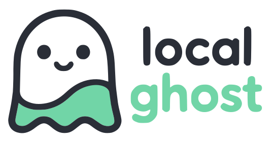

# local<span class="brand-accent">ghost</span>



Localghost is a loopback-only Docker Compose proxy that gives local
applications friendly `.localhost` URLs.

## Quick start

Requirements: Docker Engine or Docker Desktop, Docker Compose 5.x (CI tests
5.1.4), [uv](https://docs.astral.sh/uv/getting-started/installation/), and
loopback port 80 available.

Start the proxy:

```sh
uvx localghost
```

Open the dashboard at [http://traefik.localhost](http://traefik.localhost).
Stop it with:

```sh
uvx localghost down
```

## Choose a workflow

For a Docker Compose application, generate the integration configuration:

```sh
uvx localghost generate
```

For a Django or Vite server running directly on the host:

```sh
uvx localghost run
```

See [Integrate applications](integrating-applications.md) and
[Generate configuration](generating-an-override.md) for the complete Compose
contract, project naming, secondary services, and host-native workflows.

## Optional trusted HTTPS

HTTP is always available. To install Localghost's local development root and
enable HTTPS:

```sh
uvx localghost trust
```

See [Security and trust](security.md) for certificate handling and
[Operations](operations.md) for lifecycle, status, ports, and upgrades.
